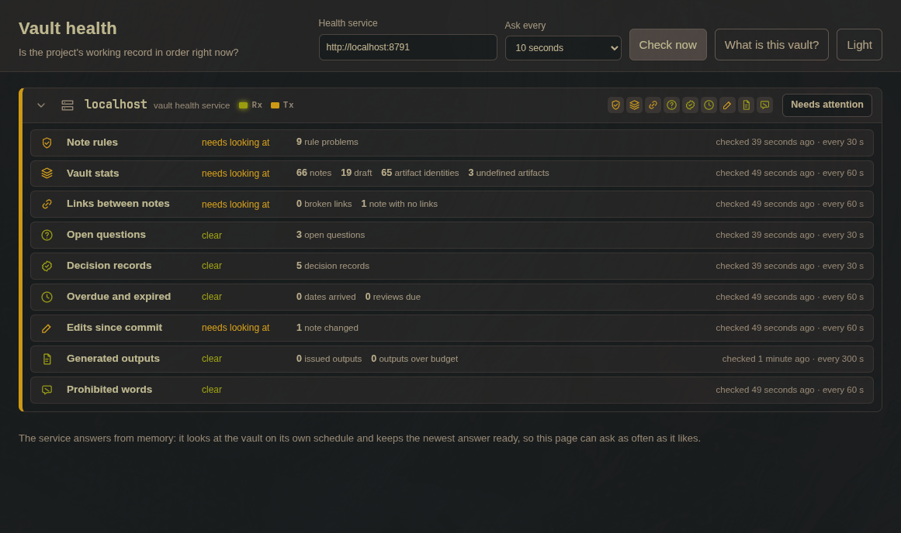
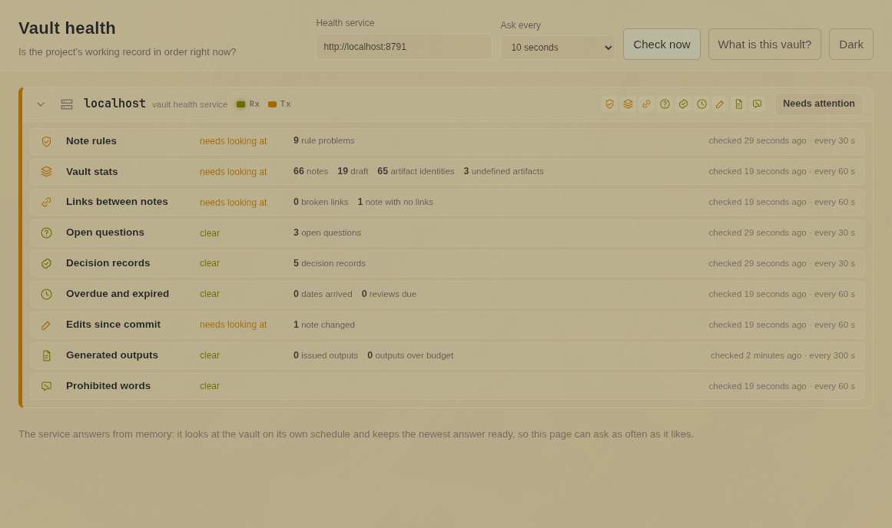
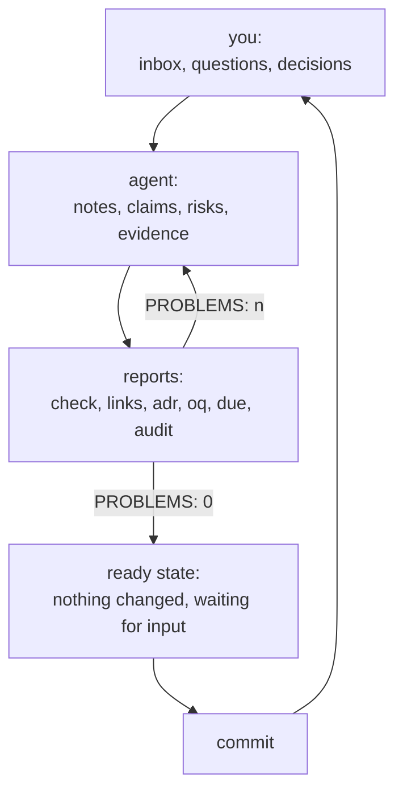

# IdeaVault

An Obsidian compatible markdown vault designed to work with AI to turn your big messy "concept of a plan" into a fully formed thought, plus the tooling that keeps the vault densely linked and the agent honest while it works on it. Loop an agent on the vault and work in the user-space or initialize a session with the agent of your choice and chat with it or both.

> **A self-governed vault of this shape holds one person's idea, in exactly the state that idea is currently in, and works to turn a messy big idea into a fully formed thought.**

The idea may be a half-stated intention, a design, a plan, a product, a research position, or a settled body of knowledge. **The mechanism does not change with maturity.** A vault holding one sentence and nine unanswered questions is a valid vault and is handled exactly like one holding a thousand entries: its gaps are recorded as open questions, empty registers, unfilled ID blocks, and `draft` statuses, and are *never filled in with plausible content by a session.*

Trust comes from every statement carrying a status, an owner, an evidence basis, and an ID that does not move. The vault is judged by one test: whether the stored idea matches the idea the owner meant to convey.

Pictured: Sample vault health dashboard demo connected to included go micro-service locally.



## The Pitch

##### *It's the adaptable knowledge vault that gives your agent a workflow it has to finish every time without needing to feed it a loop of prompts or any other wild and weird meta harness for your agent harness.*



Agents are good at producing text and bad at keeping a record. They restate, duplicate, quietly contradict, and leave you with a pile of files that no longer says what you think. This vault fixes that by giving the agent a shape it has to fit and a report that says, in numbers, whether it fit. I was never quite satisfied with the way that markdown vaults store "memory" haphazardly and the link density between the files tends to weaken over time. This vault works great with Pi and Oh My Pi out of the box and hooked up to a local Qwen3.8 Flash Next server, needs no nudging or looping to work until the vault is green again. You may need to include instructions in your harnesses system prompt telling it that it's not done until "problems" from the check tool reaches zero in order to get the same behavior out of a smaller model or different harness.

> **That is the whole loop: the agent writes, the checker drills the problems to zero, and the vault is committed the moment it is back in a ready state with every rule satisfied, every date stamped, nothing left changed on disk, everything waiting on the next thing you bring it. Undo to last good state is just the last git commit on the vault.**



Nothing about the loop is aspirational. Every command ends with `PROBLEMS: <n>` and exits 1 when it is nonzero, so "finished" is a measurable state rather than a claim in a summary. The health service runs the same reports on a schedule, so drift shows up as a red card in the dashboard instead of as a surprise six weeks later.

## What a vault holds

| Folder | What goes there |
| --- | --- |
| `00-vault/` | The mechanism itself: conventions, ID scheme, status model, requirement language, the userspace contract, reshaping rules, and `this-vault.json` |
| `01-userspace/` | The part you write in and read directly: inbox, open questions, decision records, generated outputs, and the guides |
| `10-idea/` | The idea, its shape, its operating principles |
| `20-claims/` | Requirements, constraints, assumptions, acceptance criteria |
| `30-structure/` | Components and interfaces |
| `40-plan/` | Stages and roles |
| `50-risk/` | Risks and controls |
| `60-quality/` | Gates and measures |
| `70-evidence/` | Source cards and findings |
| `80-` | Left free: a domain your idea needs and this template does not have goes here |
| `90-glossary/` | Terms, so a term means one thing everywhere |
| `99-archive/` | Superseded and rejected notes, never deleted |

`80-` is deliberately empty. A vault that cannot grow a domain is a form, not a working record.

## What the mechanism gives you

- **One identity per thing.** Every note has an ID (`REQ-012`, `ADR-0007`, `OQ-003`, `FND-014`) allocated by a command, never invented, never reused, never renumbered. Notes quote each other by ID, so a claim can be traced back to the note that made it.
- **A status model with one human gate.** `draft` → `proposed` → `accepted`. An agent may draft and propose. `accepted` is your signature, and `check` knows the difference.
- **Ownership derived from path.** `owner:` is either `vault` (mechanism) or your name (content), and the checker derives it from where the file sits. A note filed on the wrong side is a defect, not a style question.
- **An evidence chain.** Claims in the spec folders rest on `FND-###` findings, which rest on `S-###` source cards with URL, publisher, dates and an excerpt. A guess is marked `[INFERENCE]`, and an `[INFERENCE]` cannot live in an accepted note.
- **Licensed requirement language.** `MUST`, `SHOULD`, `MAY` and friends are only allowed in claim-bearing note types. Everywhere else the checker flags them, which stops an agent turning a preference into a rule.
- **Generated documents with budgets.** Output kinds (`OUT-ELEVATOR`, `OUT-BRIEF`, `OUT-EXPLAINER`) carry a word budget; `audit`, `words` and `noise` check length, registration, and whether the document leaks internal wording into something written for someone outside the vault.
- **18 commands, standard library only.** `check`, `status`, `metrics`, `ids`, `next`, `find`, `links`, `oq`, `adr`, `due`, `changed`, `stamp`, `scaffold`, `words`, `noise`, `audit`, `instantiate`, `commitmsg`.
- **A health service and a dashboard**, both small Go programs, reporting the same rules continuously.
- **Templates for every note type** (17 skeletons) and a `scaffold` command that allocates the ID and derives ownership, so starting a note correctly is easier than doing it wrong.

## What it is useful for

Anything where the idea has more moving parts than you can hold in your head and most things smaller: a product you are trying to define before writing code, a research program, a book or long-form argument, a due-diligence file, a personal project with decisions you want to be able to re-explain in two years. It is also useful when you want an agent to do the clerical half of thinking triage, cross-linking, chasing stale questions without letting it quietly rewrite what you believe.

It is not useful for a folder of loose notes you never intend to reason about.

## Quickstart

Use **Use this template** on the repository page to create your own repository from it, or clone it. Both arrive as the same single starting commit, with their own history and nothing shared back to this one:

```sh
git clone https://github.com/plihelix/IdeaVault my-idea-vault
cd my-idea-vault
python3 _tools/vault.py check
```

A fresh vault reports exactly one problem either way, and it is the file you are reading:

```
README.md:1: not a vault note: the repository front page lives outside the vault; run `instantiate <owner> "<title>"` to remove it and its images
PROBLEMS: 1
```

Alright Chuck, name the vault. You don't have to be Chuck if you don't want. This step removes this README page and writes your name into every note you own: 

```sh
python3 _tools/vault.py instantiate Chuck "The Elevator Pitch"
```

```
00-vault/this-vault.json: owner -> Chuck, name -> The Elevator Pitch
removed: README.md, assets/ (the repository front page and its images are not part of the vault)
the removal is a change to the repository: stage it and commit it
content notes rewritten: 18
PROBLEMS: 0
```

Commit that:

```sh
git add -A
python3 _tools/vault.py commitmsg "name the vault and drop the template front page"
git commit -m "<the first line commitmsg printed>"
```

Then read [`01-userspace/guides/start-here.md`](01-userspace/guides/start-here.md). It is a seven-step hour: name the vault, read the two entry pages, accept or amend the mechanism, write the idea down roughly, dump your raw material in the inbox, check, commit.

## Starting an Agent Session

Point the agent at the vault folder and make its first act a read, not a write. Paste this:

```text
You are working in a vault. Read AGENTS.md first, then HOME.md, then
01-userspace/guides/working-with-an-agent.md. Do not write anything before you have read the _index.md of every folder you intend to touch.

Allocate IDs with `python3 _tools/vault.py next <PREFIX> <folder>`; never invent one.
Draft and propose; only I set status: accepted.

Finish a round like this: run `check`, `links` and `adr`; fix everything they name; then `stamp --changed`, stage the exact paths, build the message with
`python3 _tools/vault.py commitmsg "<subject>"` after staging, commit with its first line, and stop only when `check` prints PROBLEMS: 0 and `git status --short` is empty.
```

The last line is what makes the loop close: the agent is not done when it has written something, it is done when the vault is back in a state worth committing.

## The Health Micro-service and the Demo Dashboard

Two small Go programs. Neither is required for the vault to work; the checker has no dependency on them.

```sh
cd _tools/health_service && go build -o vault-health . && ./vault-health          # 127.0.0.1:8791
```

The micro-service is configured by YAML and runs the python scripts functions periodically to serve health status to a dashboard. It is meant to be able to use any new command line options you add to the python vault checker script to its JSON response without you needing to port the new function into the micro-service.

```sh
cd _tools/dashboard_server && go build -o dashboard . && ./dashboard             # 127.0.0.1:8081
```

Open <http://127.0.0.1:8081>. The page asks the service directly (CORS is limited to the demo origins in `_tools/health_service/config.yaml`), and each card is one question with its own interval:

| Card | Command | Every |
| --- | --- | --- |
| Note rules | `check` | 30 s |
| Vault size | `metrics` | 60 s |
| Numbering | `ids` | 60 s |
| Links between notes | `links` | 60 s |
| Open questions | `oq` | 30 s |
| Decision records | `adr` | 30 s |
| Overdue and expired | `due --stale 14` | 60 s |
| Edits since commit | `changed <today>` | 60 s |
| Generated outputs | `audit` | 300 s |
| Prohibited words | `noise` | 60 s |

`_tools/health_service/config.yaml` turns checks on and off, changes intervals, moves the listen address, and adds a new check as long as it names a command. `GET /health` on 8791 is the same answers as JSON, with an `ETag` so a client can poll cheaply.

## Requirements

- Python 3.10 or newer, standard library only. No packages, no virtual environment.
- Go 1.24 or newer, only if you want the health service and the dashboard.
- Git. The commit format and the "edits since commit" report both read it.

## Conventions the vault keeps

Lowercase kebab-case filenames, one note per file, `_index.md` in every folder as that folder's law, relative links only and never a made-up example link, ISO dates, `updated:` set by `stamp --changed` before the commit, and a commit message of the form `<folder> + <folder>: <what changed> (<IDs>)` generated by `commitmsg` from the staged files.

The licence is `LICENCE` at the repository root: MIT, text unmodified, shown as the repository's terms by any code forge. It covers the template as shipped - the scripts, the mechanism notes, the skeletons, the guides, the example notes a fresh clone carries, and this front page with its images. What you write into a vault you instantiate from it is yours, and nothing in the template claims a share of it. `instantiate` leaves `LICENCE` in place: the terms under which the template was shared belong to the repository, not to the vault ([ADR-0006](01-userspace/decisions/adr-0006-the-repository-ships-a-licence-that-survives-instantiation.md)).

---

### About this file

`README.md` is not a vault note, and `assets/` exists only to hold the two pictures above. Neither has frontmatter, an ID, an owner, or a status. A vault is self-describing only when every file inside it is a note, so `check` reports this file as a problem and the vault does not reach a ready state while it is here. `LICENCE` is also not a note, and it is not reported: it is plain text, the checker governs markdown notes, and the terms the template travels under are the repository's business rather than the vault's.

`python3 _tools/vault.py instantiate <owner> "<title>"` removes `README.md` and `assets/` when it names the vault, and leaves `LICENCE` where it is. That removal is required, not cosmetic: run it before you file any of your own work, and commit the deletion. Both stay in the repository history if you want them back.
